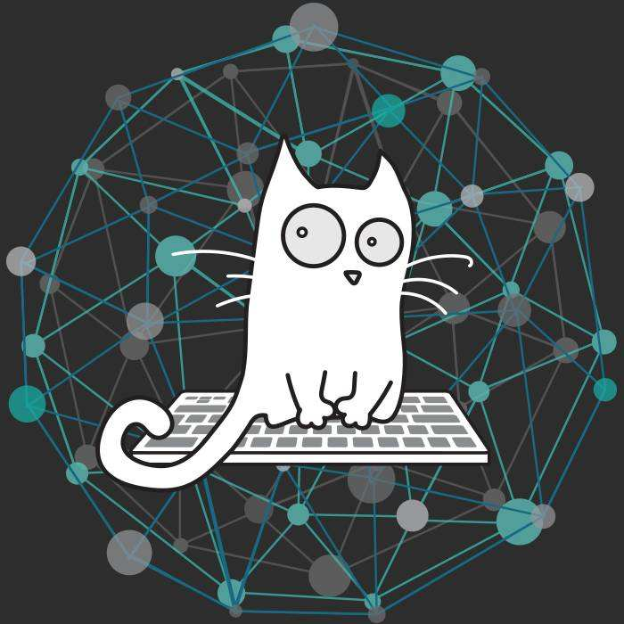

 <table border="0">
   <tr>
     <td width="75%">
       <h1>李文涛</h1>
       
<b></b>
本科
       
<b>浙江万里学院信息与智能工程学院/b>

       
<b>邮箱：1580846439@qq.com>
       
<b>地址：上海市金山区海丰路126号</b>

     </td>
     <td width="25%">
             % 插入证件照代码
     </td>
   </tr>
 </table>

#### 对自己说；People can be mediocre for a while ,but it doesn't mean that they will always be mediocre.     
####          I hope today I am a little better than I was yesterday.
### 最新消息
1.小菜鸡开始搞汉化了，vs，resharper都好难，也许我不如别人，但我不甘心在这止步。
### 研究方向
——网络安全
——防火墙
——代码加
### 荣誉奖励
——小奖不好意思说，期待我能填上这里的一天
### 学校
——浙江万里学院
### 个人爱好
——励志成为网络空间安全工程师
——日本动漫（伤心时总的找点能安慰下自己的东西）
——足球、网球（都是业余）
